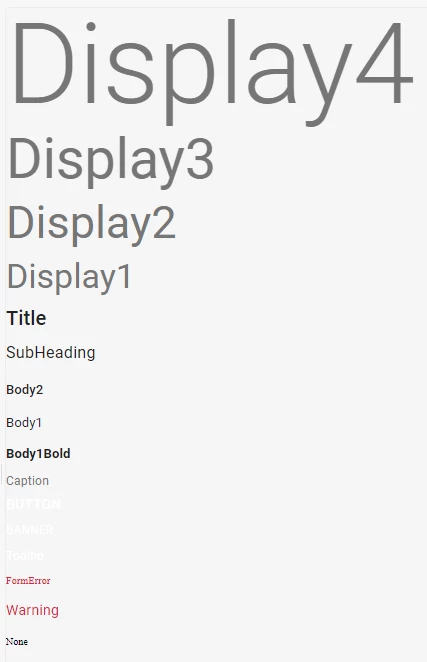

# React - Text and Translations

We require translations in all apps and all text displayed to the user, because in the future we may be international. We also very commonly have formatted text. We have a process in place that can make this very easy.


- [React - Text and Translations](#React---Text-and-Translations)
  - [Typography](#Typography)
  - [Translating](#Translating)
  - [Json Files](#Json-Files)
  - [Language Provider](#Language-Provider)


## Typography
We have defined all of out typography in our themes. If you are asked to create any text that is formatted but doesn't follow any of the defined typography we have, you really need to quest design if they really want that. __There is an entire page about typography over in the design space.__ Here are the typography types in the v1 theme.




## Translating
We can translate things 3 ways. The default way is with FormattedMessage. But, we need to format the text we are translating. You could nest the DynamicText and FormattedMessage component, but because this is something done often we have a component that does this for you, called Text. If 

```javascript
// Using a formatted message by itself.
import { FormattedMessage } from 'react-intl';
 
<FormattedMessage
  id="affiliates.remove.button"
  defaultMessage="REMOVE"
/>
 
//We have already pre built these components, use them!
 
 
// Using a text component to have formatting and translation.
import { Text, TypographyTypes } from '@dealersocket/ds-ui-react';
 
<Text
  type={TypographyTypes.Body2}
  id="affiliates.add.header"
  defaultMessage="Add new dealership group"
/>
 
// Using a DynamicText component to have formatting. This is used for when the text you are displaying is user input.
import { DynamicText, TypographyTypes } from '@dealersocket/ds-ui-react';
 
<DynamicText
  type={TypographyTypes.Body2}
  {dynamicThingIAmDisplaying}
/>
```


## Json Files
Your json files should be named after the language it is for. IE: en.json, es.json. There should only be one language within a json file. All of these files should be in src/shared/translations
Within the file it should follow a few rules. These rules give us consistent and easy to navigate files.

* Flat. No nesting of keys.
* All lowercase. No capitals at all within the keys.
* Dot notation. Have a single . between words, and never use other characters such as _ or -.
* Group by area and then feature within area.

```json
{
  "page.not.found.error": "Page not found!",
  "menu.header.title": "Enterprise settings",
  "menu.option.enterprise.admin": "Enterprise admin settings",
  "menu.option.affiliates": "Dealership groups",
  "menu.option.dealership.settings": "Grouped dealership settings"
  "feature.management.header.title": "Enterprise feature management",
  "feature.management.header.save": "SAVE",
  "feature.management.page.title": "Linked customer accounts",
  "feature.management.page.warning": "These settings determine whether admin-level users within your organization can access and customize aspects of linked customer accounts in connected dealership settings.",
  "feature.management.option.show.linked.accounts.header": "Show linked accounts",
  "feature.management.option.show.linked.accounts.body": "Allow users to view linked customer accounts in search results",
}
```

## Language Provider

TODO: document the language provider and how it wraps the IntlProvider.